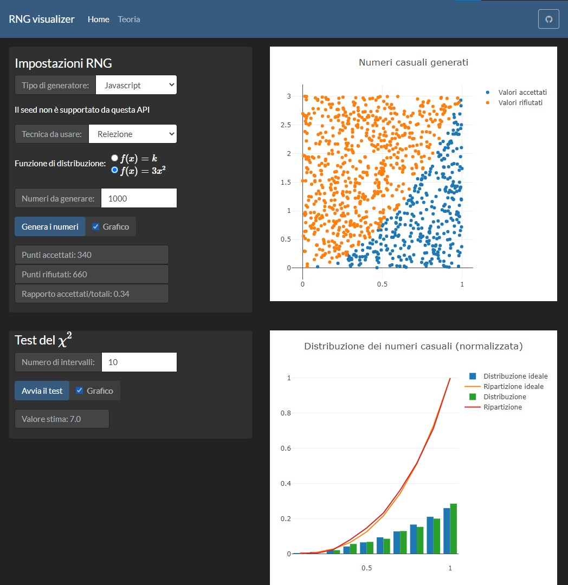
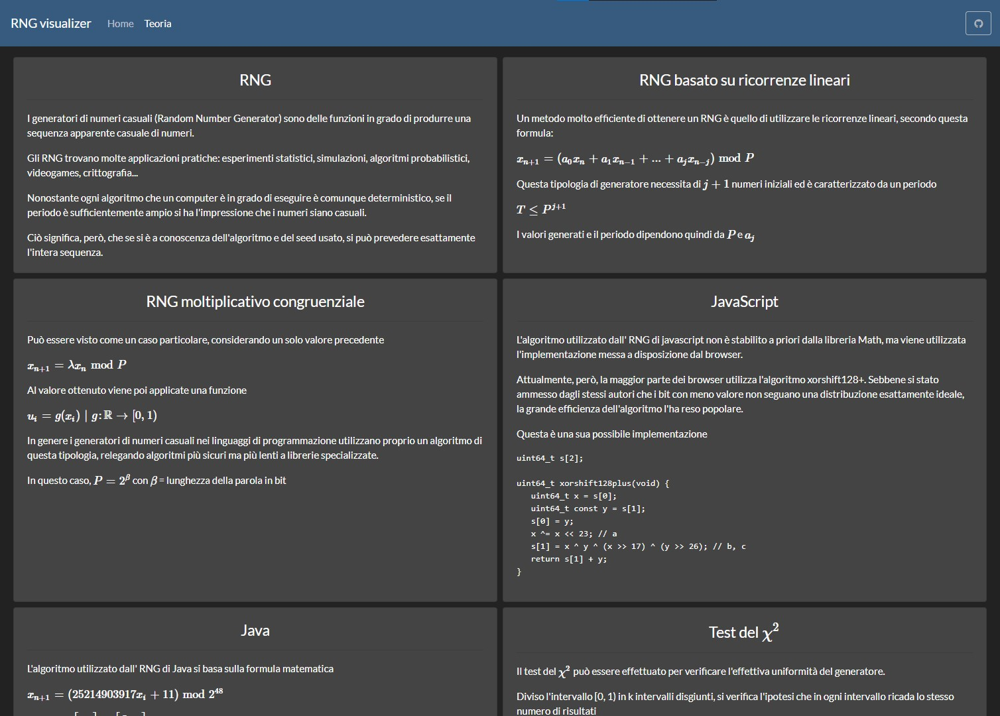

# RNG visualizer
[Traduzione italiana](repo/README-it.md)

## :red_circle: [Live version](https://tendto.github.io/RNG-visualizer/)

## :wrench: Setting up a local istance

#### Requirements
- [Node](https://nodejs.org/en/) [v 15.1.0]
- [Angular CLI](https://github.com/angular/angular-cli) [v 10.0.8]

#### Development server
Run `ng serve` for a dev server. Navigate to `http://localhost:4200/`. The app will automatically reload if you change any of the source files.

#### Build
Run `ng build` to build the project. The build artifacts will be stored in the `dist/` directory. Use the `--prod` flag for a production build.

## Credits
- [Bootswatch (Darkly)](https://bootswatch.com/darkly/) for the css styling
- [Plotly js](https://plotly.com/javascript/) for the graph
