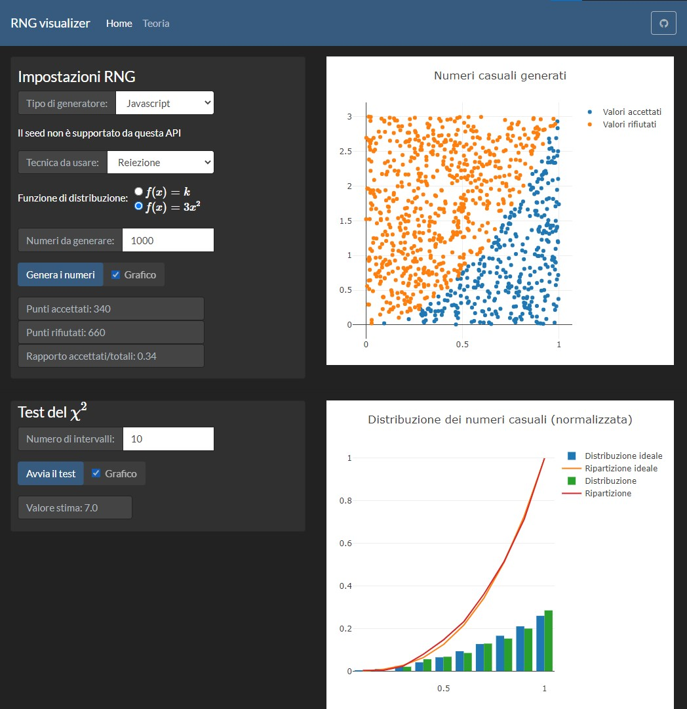
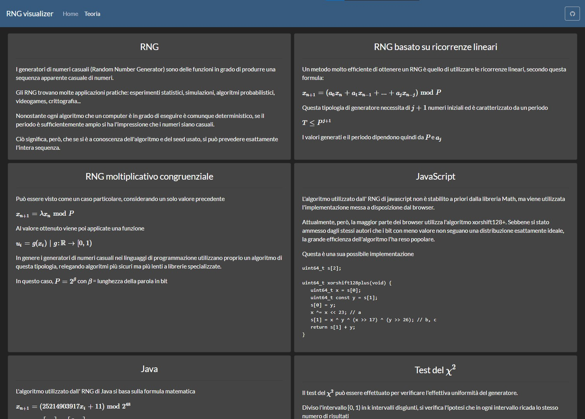

# RNG visualizer
[English translation](../README.md)

## :red_circle: [Versione online](https://tendto.github.io/RNG-visualizer/)

## :wrench: Istanza locale

#### Requisiti
- [Node](https://nodejs.org/en/) [v 15.1.0]
- [Angular CLI](https://github.com/angular/angular-cli) [v 10.0.8]

#### Server di sviluppo
Esegui `ng serve` per lanciare un dev server. Vai su `http://localhost:4200/`. L'applicazione rileverà ogni cambiamento e si aggiornerà di conseguenza.

#### Build
Esegui `ng build` per buildare il progetto. I file generati saranno posizionati nella cartella `dist/`. Aggiungi `--prod` per una build di produzione.

## Credits
- [Bootswatch (Darkly)](https://bootswatch.com/darkly/) for the css styling
- [Plotly js](https://plotly.com/javascript/) for the graph
